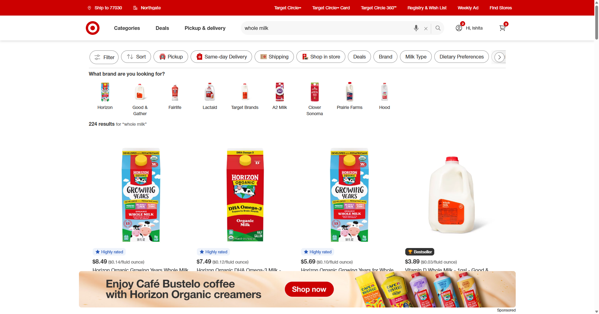
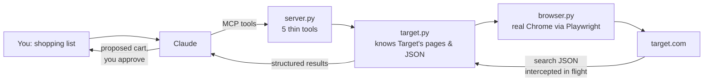
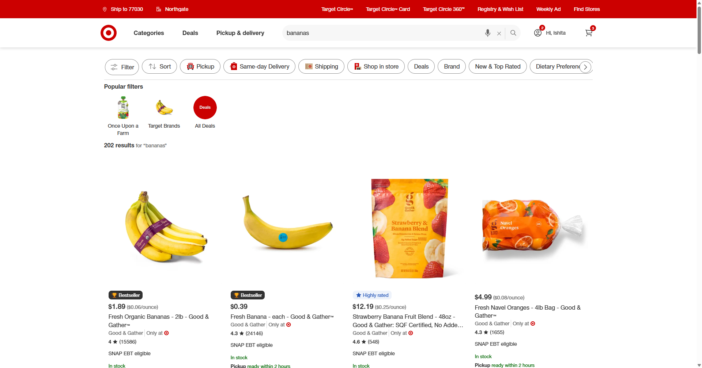
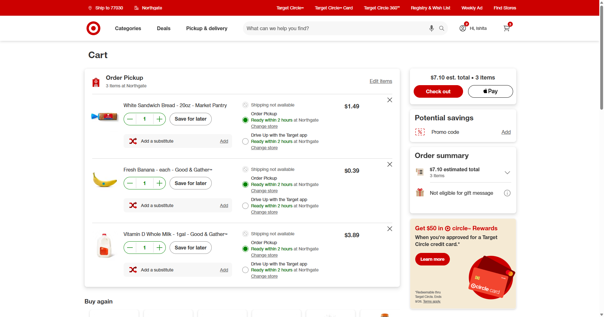

# 🛒 MCP Server — Personal Shopping (Target Grocery)

**An AI agent that does my grocery shopping.** I tell Claude *"2 gallons of whole
milk, a dozen eggs, bananas"* — it searches Target, compares prices and unit
prices, shows me what it wants to add, and fills my cart. I review and check out
myself. **There is no checkout automation, on purpose.**

⭐ If this is useful to you, consider starring the repo — it helps others find it.

Built as a weekend project on the [Model Context Protocol
(MCP)](https://modelcontextprotocol.io) — think of MCP as a **USB port for AI
apps**: you plug a tool server into Claude, and Claude can suddenly *do* things,
not just talk about them.


*The agent's browser searching Target — 224 results for "whole milk", sorted by
unit price, sponsored listings filtered out.*

## What it does (and doesn't)

| | |
|---|---|
| ✅ Signs in to Target | with credentials **you** keep in a local, gitignored file |
| ✅ Searches groceries | returns price, **unit price**, stock at *your* store, ratings |
| ✅ Manages the cart | add, view, remove |
| ❌ Checkout / payment | **never** — you place the order yourself |

**5 tools, deliberately small:**

| Tool | Returns |
|---|---|
| `login()` | `{state, store}` — reports the session, signing in from `target.env` only if needed. Safe to call any time. |
| `search_grocery(query, limit=5)` | `item_id, name, brand, price, price_string, unit_price, in_stock, fulfillment, rating, review_count, snap_eligible, url` |
| `add_to_cart(item_id, quantity=1)` | `{ok, quantity_added, partial}` or a reason |
| `view_cart()` | parsed items and subtotal |
| `remove_from_cart(item_id)` | `{ok}` or a reason |

`unit_price` (`"$0.03"` per fl oz) is the field that makes grocery picking sane
— it's how you tell a gallon beats four half-gallons.

Sponsored results are filtered out. 6 of 30 results in a live sample were
sponsored, so this matters.

## How it's wired



## Why a browser and not an API

Target has no public cart API. So this drives real Chrome via Playwright, in
its own window, signing in with credentials you put in `target.env`.

Consequence: it's scraping. Expect to fix `target.py` when Target reshuffles
their markup, and expect the occasional bot challenge you clear by hand.

> This project previously targeted Walmart. Walmart's PerimeterX now hard-blocks
> an automated browser — `/blocked`, "Robot or human?", on the homepage. Target,
> checked the same hour from the same browser, served every page cleanly.

## Setup, step by step

Works for total beginners — each step is one command.

### Step 1 — Get the code and install dependencies

```bash
git clone https://github.com/ishita199615/MCP_Server_PersonalShopping.git
cd MCP_Server_PersonalShopping
python -m venv .venv && .venv/Scripts/python.exe -m pip install -r requirements.txt
```

### Step 2 — Make sure Chrome is installed

The server drives **real Chrome** (`channel="chrome"`), not a bundled Chromium,
in its own user-data-dir at `.session/`. Your everyday Chrome and its profiles
are untouched.

### Step 3 — Add your Target credentials (locally, never committed)

```bash
cp target.env.example target.env
```

Fill in `TARGET_EMAIL` and `TARGET_PASSWORD`. `target.env` is gitignored. The
values are read at sign-in time, typed into Target's form, and never logged,
cached, or returned from a tool — tool output goes into a model's context, so
anything returned there would be a leak.

### Step 4 — Plug it into Claude Code

Register at user scope, so the tools are available from any directory (replace
the paths with wherever you cloned it):

```bash
claude mcp add target-grocery -s user -e PYTHONPATH=D:\shoppingMCP -- D:\shoppingMCP\.venv\Scripts\python.exe -m target_mcp.server
```

That writes to `~/.claude.json`. The paths are absolute — re-run it if you move
the project. `claude mcp list` shows connection status.

`PYTHONPATH` is not optional: without it the server can't import `target_mcp`
when launched from an unrelated working directory.

### Step 5 — First run

1. Ask Claude to call `login`. A Chrome window opens and it signs in from
   `target.env`, ticking "keep me signed in".
2. **You may get `state: "needs_code"`.** Target sends a one-time code on a new
   device. Type it into the open Chrome window — nothing here can read your
   email or texts — then call `login` again.
3. The session persists in `.session/`, so this is a first-run cost. After
   that `login` just reports.

### Step 6 — Go shopping

Say something like:

> *"Add whole milk, bananas, and a dozen eggs to my Target cart — cheapest per
> unit, in stock at my store."*

Claude searches, proposes picks with prices, and adds what you approve:


*Same flow for bananas — the agent reads price, unit price, and store stock for
each result.*


*The end state: a filled cart, waiting for a human to check out.*

### Check the store

`login` reports the store and ZIP the site is using. **Grocery price and stock
are per-store**, and signing in switches to the store saved on your account —
which may not be near you. Change it in the Chrome window; it persists.

### If sign-in doesn't go through

| `state` | What it means |
|---|---|
| `signed_in` | Done. |
| `needs_code` | Type the code in the window, then call `login` again. |
| `bad_credentials` | Target rejected them. Check `target.env`. |
| `challenge` | Bot wall. Clear it by hand in the window, then retry. |
| `username_field_not_found` / `password_field_not_found` | Markup changed. Fix the selectors at the top of `target.py`. |
| `unknown` | Submitted, but the result page isn't recognizable. Look at the window. |

## Design notes

- `browser.py` — Playwright lifecycle, one persistent session dir, one shared
  page. Prefers [patchright](https://github.com/Kaliiiiiiiiii-Vinyzu/patchright)
  if installed; `TARGET_MCP_PLAIN_PLAYWRIGHT=1` forces stock Playwright,
  `TARGET_MCP_HEADLESS=1` hides the window (you'll regret it the first time a
  challenge appears), `TARGET_MCP_SESSION_DIR` moves `.session/`.
- `creds.py` — the only module that touches credentials. Reads `target.env`
  then `.env` with a twenty-line parser rather than taking a dependency on the
  credentials path. A real environment variable beats the file.
- `target.py` — the only module that knows Target's URLs, JSON shape, and
  selectors. **When the site changes, this is the file you fix.**
- `server.py` — thin tool definitions. Every failure comes back as a structured
  value (`blocked`, `timeout`, `no_credentials`, `out_of_stock`,
  `add_button_not_found`) rather than an exception across the MCP channel.

### Five things that are not obvious

**Search results are not in the page.** Not in the HTML, not in `__NEXT_DATA__`
— both were checked and neither contains a single `tcin`. The product list
arrives in a separate call to `cdui-orchestrations.target.com/.../pages/slp`.
So `search` navigates and reads Target's own API response as it goes by, which
means the results carry Target's store, ZIP and session without us
reconstructing the request. DOM scraping is the fallback.

**Groceries don't ship.** `shipping_options.availability_status` is
`OUT_OF_STOCK` for most of the dairy aisle. Stock lives in
`store_options[].order_pickup`. Reading the shipping field as `in_stock` marks
the whole aisle unavailable — there's a test pinning this.

**Sponsored products appear twice.** Once flagged, once as an unflagged copy
elsewhere in the payload. Filtering node-by-node lets the ad back in through
the side door, so `extract_products` collects every sponsored tcin first and
excludes all of them.

**The fulfillment tabs are never `disabled`.** An unavailable one just reads
"Not available", so `is_enabled()` returns true and clicking pickup blindly
strands you on a dead tab — after which the buy button is gone and the failure
looks like "markup changed". `add_to_cart` reads the tab text and picks a
channel that actually works.

**Cart lines are found via the delete button.** `[data-test*="cartItem"]` hooks
nest, so they return one product six times; every `/p/` link on the page picks
up the recommendation carousels instead. Only real cart lines have a delete
button. The order summary likewise has its own elements — the word "Subtotal"
never appears as body text, so regexing for it silently returns nothing.

## Tests

```bash
.venv/Scripts/python.exe -m pytest tests -q
```

23 parser tests run offline against a captured `pages/slp` payload in
`tests/fixtures/`. They're the early warning system: when Target changes their
JSON, these fail loudly instead of the server quietly returning nulls.

For live checks:

```bash
.venv/Scripts/python.exe smoke_test.py "whole milk"
```

Add `--login` to sign in from `target.env` first, or `--add <tcin>` to exercise
the cart write.

## Known limits

- **Quantity above 1 is not automated.** `add_to_cart` adds one and says so —
  the product page used to build this had no quantity stepper. Adjust in the
  cart.
- `view_cart` parses a client-rendered page best-effort. If it returns
  `parsed: false`, trust the browser window over the tool output.
- **Your store decides almost everything.** Signing in switches to the store
  saved on your account, which may not be near you. A store that doesn't do
  grocery fulfillment returns `pickup/delivery/shipping: false` for every
  perishable item, and `add_to_cart` returns `out_of_stock_at_store` — the code
  is fine, the store is wrong. Check `login`, fix it in the browser.
- Target runs PerimeterX too — the same vendor now blocking Walmart. It is
  permissive today; that is not a guarantee.

## One caveat worth stating plainly

Automated access is against Target's terms of service. This is your account and
your groceries, but the account risk is yours.
